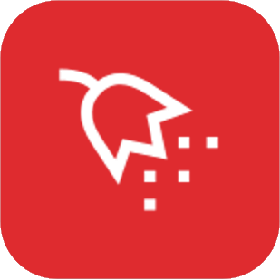

# Jeedom - Plugin pollenwatcher

Parfait pour les allergiques! Permet de surveiller le pollen région par région. Les informations proviennent du site NRSA (Réseau National de Surveillance Aérobiologique)

_[Documentation](https://github.com/titof2375/pollenwatcher/blob/master/docs/fr_FR/index.md)_

_[changelog](https://github.com/titof2375/pollenwatcher/blob/master/docs/fr_FR/changelog.md)_
